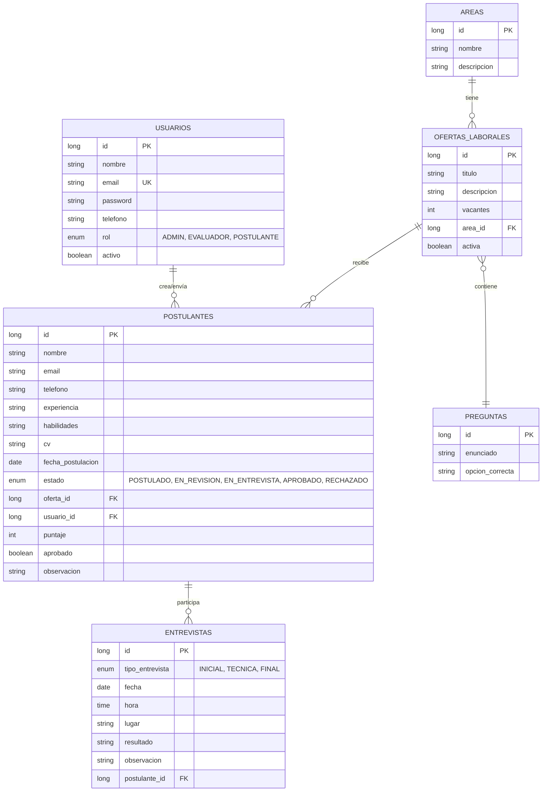

# Diagrama Entidad-Relación - Sistema de Reclutamiento



## Descripción de Relaciones

### 1. USUARIOS → POSTULANTES (1:N)
- Un usuario puede crear múltiples postulaciones
- Relación: Un usuario se postula a una o más ofertas
- Integridad referencial: usuario_id en POSTULANTES

### 2. ÁREAS → OFERTAS_LABORALES (1:N)
- Un área puede tener múltiples ofertas laborales
- Relación: Cada oferta pertenece a un área
- Integridad referencial: area_id en OFERTAS_LABORALES

### 3. OFERTAS_LABORALES → POSTULANTES (1:N)
- Una oferta recibe múltiples postulaciones
- Relación: Cada postulante se postula a una oferta
- Integridad referencial: oferta_id en POSTULANTES

### 4. OFERTAS_LABORALES ↔ PREGUNTAS (M:N)
- Una oferta tiene múltiples preguntas de evaluación
- Una pregunta puede usarse en múltiples ofertas
- Tabla asociativa: PREGUNTAS_OFERTAS (pregunta_id, oferta_id)

### 5. POSTULANTES → ENTREVISTAS (1:N)
- Un postulante puede tener múltiples entrevistas
- Relación: Cada entrevista está asociada a un postulante
- Integridad referencial: postulante_id en ENTREVISTAS

## Campos Principales

### Entidad USUARIOS
- **id**: Identificador único (PK)
- **email**: Correo único por usuario (UK - Unique Key)
- **rol**: Enum con valores: ADMIN, EVALUADOR, POSTULANTE
- **activo**: Indica si el usuario está habilitado

### Entidad POSTULANTES
- **estado**: Enum con los estados del proceso:
  - POSTULADO: Inicial
  - EN_REVISION: Siendo evaluado
  - EN_ENTREVISTA: En fase de entrevista
  - APROBADO: Seleccionado
  - RECHAZADO: No pasó filtros
- **puntaje**: Calificación de evaluación (0-100)
- **aprobado**: Boolean que indica aprobación final

### Entidad ENTREVISTAS
- **tipo_entrevista**: 
  - INICIAL: Entrevista de presentación
  - TECNICA: Evaluación técnica
  - FINAL: Decisión final

## Índices Recomendados

```sql
-- Búsquedas frecuentes
CREATE INDEX idx_postulantes_email ON postulantes(email);
CREATE INDEX idx_postulantes_oferta_id ON postulantes(oferta_id);
CREATE INDEX idx_postulantes_estado ON postulantes(estado);
CREATE INDEX idx_ofertas_area_id ON ofertas_laborales(area_id);
CREATE INDEX idx_ofertas_activa ON ofertas_laborales(activa);
CREATE INDEX idx_entrevistas_postulante_id ON entrevistas(postulante_id);
```
